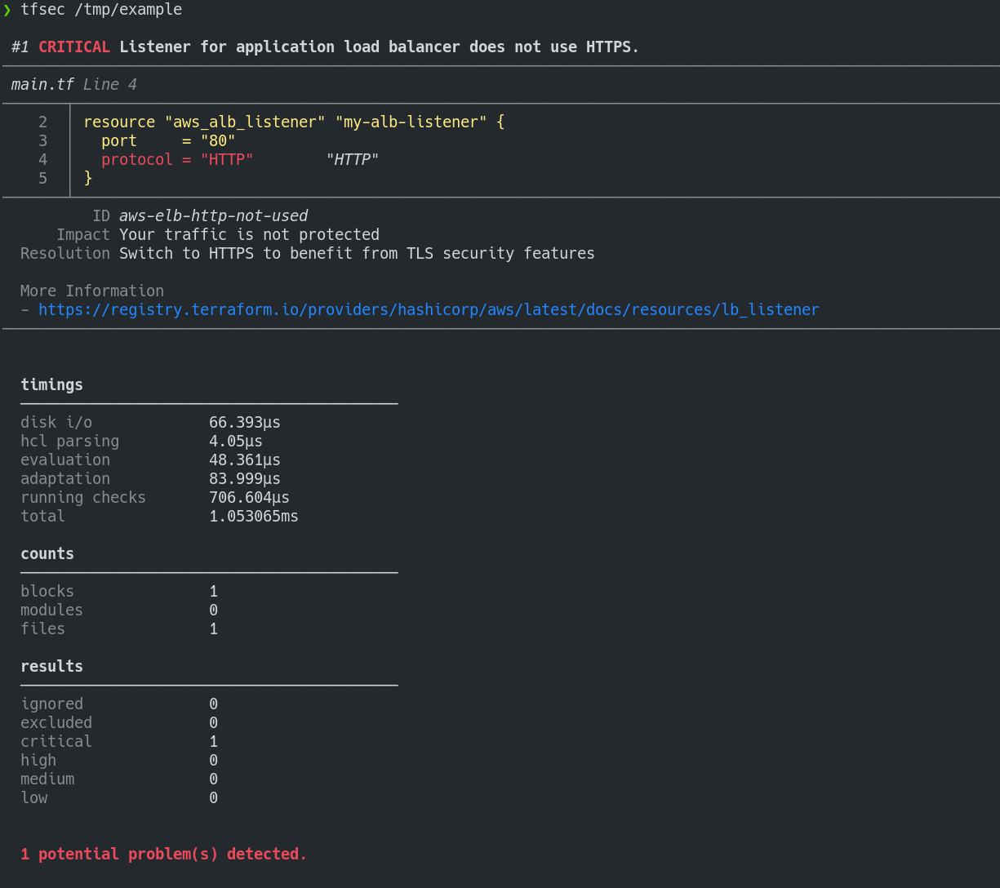

# tfsecurity

tfsecurity is a static analysis tool for Terraform that spot potential misconfigurations.

## Features

- Checks for misconfigurations across all major (and some minor) cloud providers
- Hundreds of built-in rules
- Scans modules (local and remote)
- Evaluates HCL expressions as well as literal values
- Evaluates Terraform functions e.g. `concat()`
- Evaluates relationships between Terraform resources
- Compatible with the Terraform CDK
- Applies (and embellishes) user-defined Rego policies
- Supports multiple output formats: lovely (default), JSON, SARIF, CSV, CheckStyle, JUnit, text, Gif.
- Configurable (via CLI flags and/or config file)
- Very fast, capable of quickly scanning huge repositories
- [Plugins for popular IDEs](https://khulnasoft.github.io/tfsecurity/docs/integrations/) available
- [Community-driven](https://slack.khulnasoft.com/) - come and chat with us!

## Recommended by Thoughtworks

Rated _Adopt_ by the [Thoughtworks Tech Radar](https://www.thoughtworks.com/en-gb/radar/tools/tfsecurity):

> For our projects using Terraform, tfsecurity has quickly become a default static analysis tool to detect potential security risks. It's easy to integrate into a CI pipeline and has a growing library of checks against all of the major cloud providers and platforms like Kubernetes. Given its ease of use, we believe tfsecurity could be a good addition to any Terraform project.

## Example Output

## Installation

Install with [brew/linuxbrew](https://brew.sh)
